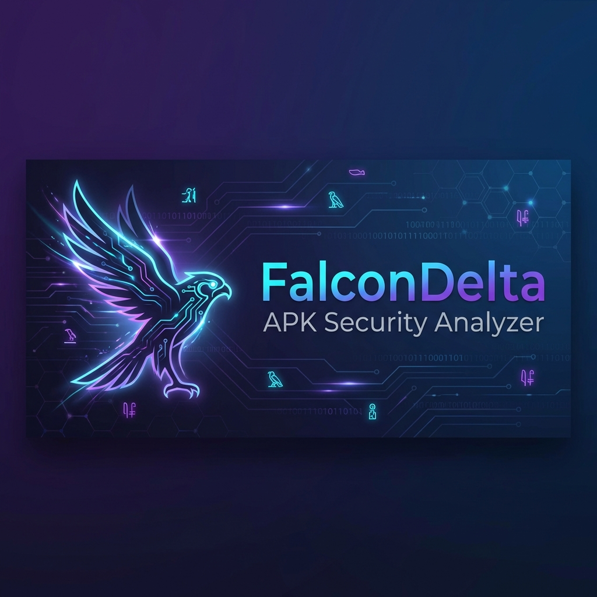
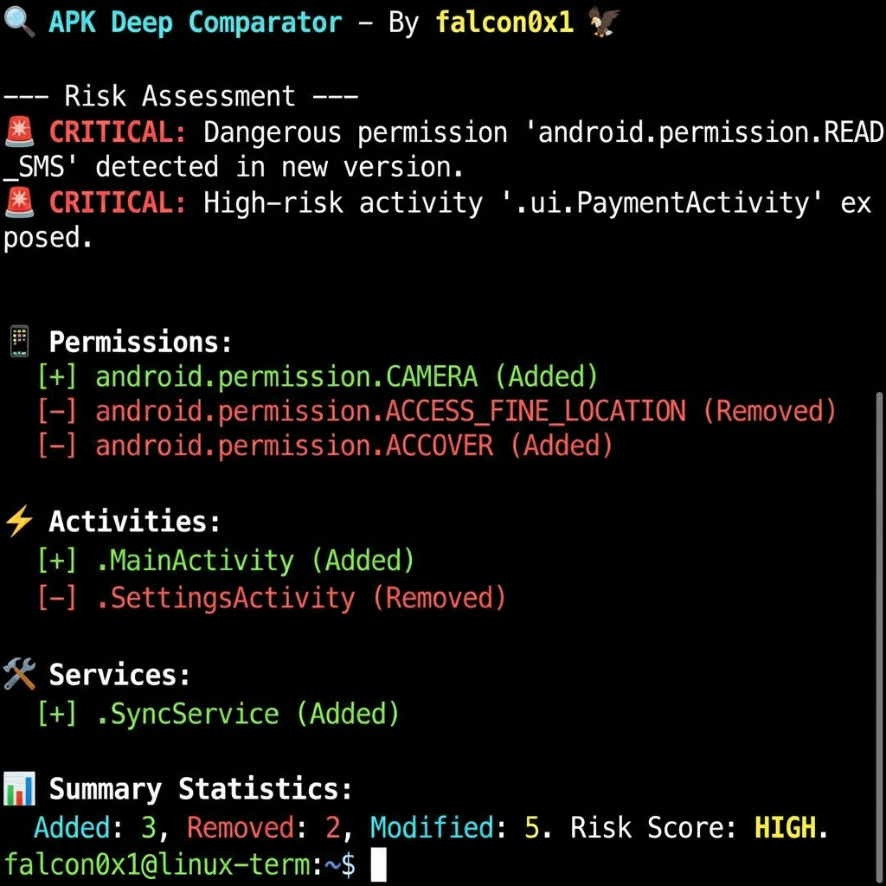
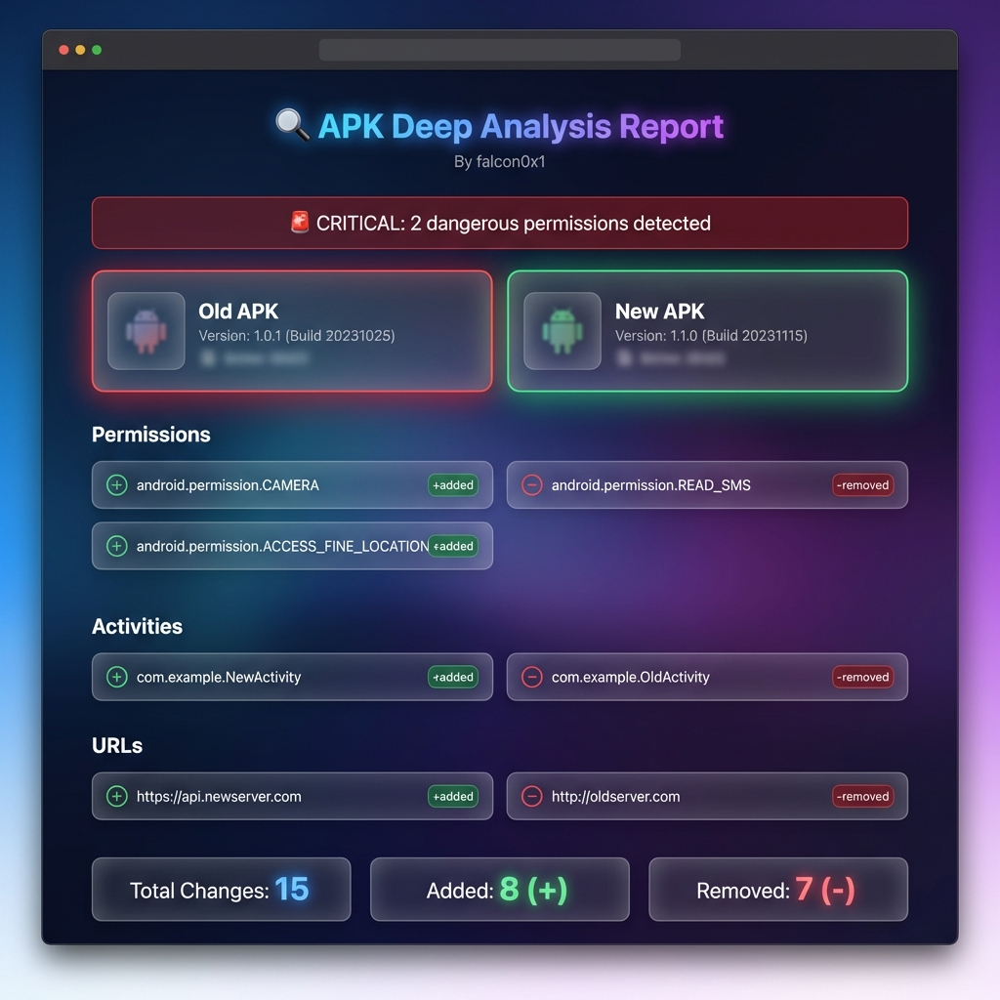

<p align="center">
  
</p>

<p align="center">
  
  
  
  
</p>

<p align="center">
  <strong>A powerful Android APK security analysis and comparison tool</strong>
  <br>
  <em>Detect changes, identify risks, and protect your attack surface</em>
</p>

<p align="center">
  <strong>By <a href="https://github.com/falcon0x1">falcon0x1</a> 𓅃</strong>
</p>

---

## 𓅃 The Problem

When a new version of an Android app is released, **how do you know what changed?**

- What new **permissions** were added? Are they dangerous?
- Are there new **API endpoints** that could be vulnerable?
- What new **activities/services** were introduced?
- Is the app trying to access your **SMS, Camera, or Location**?

**FalconDelta** solves this by:
1. Extracting comprehensive metadata from APK files
2. Performing deep DEX analysis to find hidden URLs
3. Comparing two versions to identify all changes
4. **Highlighting security risks** with a smart risk assessment system

---

## 𖤍 Features

| Feature | Description |
|---------|-------------|
| 𓅃 **APK Analysis** | Extract permissions, components, and metadata |
| 𓆲 **Deep DEX Analysis** | Find hidden URLs, API endpoints, and sensitive strings |
| ⌘ **Version Comparison** | Compare two APKs and identify all changes |
| 𓅆 **Risk Assessment** | Automatic risk scoring (Critical/High/Medium/Low) |
| 𓆲 **Dangerous Permissions** | Detect 30+ risky permissions (SMS, Camera, etc.) |
| 𓅓 **Multiple Outputs** | Terminal, JSON, and beautiful HTML reports |

---

## ⬢ Quick Start

### Installation

```bash
# Clone the repository
git clone https://github.com/falcon0x1/FalconDelta.git
cd FalconDelta

# Create virtual environment
python -m venv venv

# Install dependencies
./venv/bin/pip install -r requirements.txt
```

### Basic Usage

```bash
# Analyze a single APK
./venv/bin/python falcondelta.py analyze app.apk

# Compare two APK versions
./venv/bin/python falcondelta.py compare old.apk new.apk

# Deep analysis with URL extraction
./venv/bin/python falcondelta.py compare old.apk new.apk --deep

# Generate HTML report
./venv/bin/python falcondelta.py compare old.apk new.apk --deep --html report.html
```

---

## 𓅂 Screenshots

### Terminal Output

<p align="center">
  
</p>

The terminal output shows:
- 𓆲 **Risk Assessment** with Critical/High/Medium/Low warnings
- 𓅈 **Added** items highlighted in green
- 𓅉 **Removed** items highlighted in red
- 𓅃 **Summary statistics** with color-coded counts

### HTML Report

<p align="center">
  
</p>

The HTML report features:
- 𖤍 Modern dark theme with glassmorphism design
- 𓆲 Animated warning banners for critical risks
- 𓅃 Side-by-side version comparison
- ⌘ Dedicated sections for URLs and API endpoints

---

## 𓆲 Dangerous Permissions Detected

The tool automatically flags these high-risk permissions:

| Category | Permissions |
|----------|-------------|
| **𓅂 SMS & Calls** | READ_SMS, SEND_SMS, READ_CALL_LOG, CALL_PHONE |
| **𖤍 Location** | ACCESS_FINE_LOCATION, ACCESS_BACKGROUND_LOCATION |
| **𓅆 Camera/Mic** | CAMERA, RECORD_AUDIO |
| **𓆲 Storage** | READ_EXTERNAL_STORAGE, MANAGE_EXTERNAL_STORAGE |
| **⬢ System** | REQUEST_INSTALL_PACKAGES, BIND_DEVICE_ADMIN |
| **𓅈 Contacts** | READ_CONTACTS, READ_CALENDAR |

---

## ⌘ CLI Reference

### Analyze Command
```bash
./venv/bin/python falcondelta.py analyze [OPTIONS] APK_PATH

Options:
  --json    Output in JSON format
  --deep    Enable deep DEX analysis (extract URLs)
  --help    Show help message
```

### Compare Command
```bash
./venv/bin/python falcondelta.py compare [OPTIONS] APK_OLD APK_NEW

Options:
  --json         Output in JSON format
  --html PATH    Save report as HTML file
  --deep         Enable deep DEX analysis
  --help         Show help message
```

---

## 𓅓 Requirements

- Python 3.8+
- androguard >= 3.4.0
- click >= 8.0.0

---

## 𓅃 Use Cases

- **Security Researchers**: Analyze APK updates for new attack surfaces
- **Penetration Testers**: Identify new API endpoints and permissions
- **Developers**: Track changes between app versions
- **Privacy Advocates**: Check what permissions apps are requesting

---

## 𓅈 Contributing

Contributions are welcome! Please feel free to submit a Pull Request.

---

## 𓅓 License

This project is licensed under the MIT License - see the [LICENSE](LICENSE) file for details.

---

## 𓅃 Author

<p align="center">
  
</p>

<p align="center">
  <strong>falcon0x1</strong> 𓅃
  <br>
  <a href="https://github.com/falcon0x1">GitHub</a>
</p>

---

<p align="center">
  <strong>Made with 𖤍 for the security community</strong>
</p>
